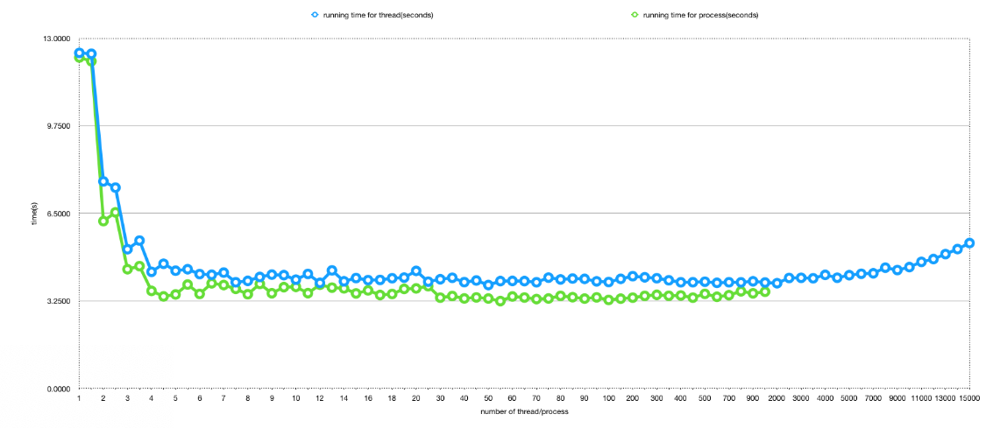

# Assignment 1
# Student: Jialiang He
# Student number: 7806975

### In this assignment, I picked problem **Brute-forcing passwords**:   
    In this problem, the password is only numbers, no characters.
    Also the password is predefind, and the password for process and thread are same.

### **Data**:
    For the problem Brute-forcing password, I set a fixed number n for the password, therefore I know there are only n^10 different possible password.

    In side the program, I compute a variable called **work_per_process** for process.c and **word_per_thread** for thread.c. This variable calculated based on the number of process/thread, and the total possible passsword (n^10). 

    Therefore, each process/thread will be passed 2 things, one is where to start, and other is how much work need to be done.

    And these data are generate in side the child process or thread.

### **Run program**:
    I have 2 separate c file. one named 'process.c' and other named 'thread.c'.
    
### To compile those files, please use the ***Makefile***:
~~~~
make thread   // this will compile thread.c
make process  // this will compile process.c
./thread      // this will run thread.c
./process     // this will run process.c
~~~~
### ***Note***: ***when you run process or thread, the program will ask your input the number of process and thread you want. Please give some interger to run those program.***

### **Analysing performance**:
#### 1. _Data set_:

    The set of data I used for the problem is all possible 8 digits strings. So that is 00000000, 00000001, 00000002, ... , 99999998 , 99999999.
    These data will generate and compare with the 'password' by each child process and threads when they are running.

#### 2. _Hardware & Environment_:
    
    processor speed: 2.7 GHz Intel Core i5
    memory: 16 GB 1600 MHz DDR3
    operating system: Mac OS
    shell: -bash

### 3. _Experiments_:
| numer of threads / process | running time for thread(seconds) |  running time for process(seconds) |
|------------------|--------------|------------------|--------------| 
| 1                |12.4561|12.2864
| 1                |12.4228|12.1476
| 2                |7.6865|6.2126
| 2                |7.4565|6.5387
| 3                |5.1698|4.4280
| 3                |5.4922|4.5431
| 4                |4.3314|3.6234
| 4                |4.6305|3.4185
| 5                |4.3727|3.4907
| 5                |4.4277|3.8589
| 6                |4.2476|3.5110
| 6                |4.2222|3.9060
| 7                |4.3024|3.8409
| 7                |3.9438|3.6996
| 8                |3.9948|3.4985
| 8                |4.1402|3.8828
| 9                |4.2276|3.5365
| 9                |4.2088|3.7631
| 10               |4.0412|3.7726
| 11               |4.2535|3.5401
| 12               |3.9207|3.8511
| 13               |4.3845|3.7452
| 14               |3.9799|3.7175
| 15               |4.1006|3.5299
| 16               |4.0229|3.6425
| 17               |4.0315|3.4711
| 18               |4.0931|3.5077
| 19               |4.1173|3.6980
| 20               |4.3651|3.7152
| 25               |3.9665|3.7975
| 30               |4.0562|3.3733
| 35               |4.1109|3.4341
| 40               |3.9490|3.3430
| 45               |4.0094|3.3822
| 50               |3.8407|3.3404
| 55               |3.9878|3.2460
| 60               |3.9931|3.4163
| 65               |3.9872|3.3781
| 70               |3.9435|3.3205
| 75               |4.1169|3.3411
| 80               |4.0494|3.4396
| 85               |4.0811|3.3902
| 90               |4.0695|3.3374
| 95               |3.9780|3.3841
| 100               |3.9529|3.2878
| 150              |4.0698|3.3349
| 200              |4.1696|3.3732
| 250              |4.1286|3.4387
| 300              |4.0930|3.4769
| 350              |4.0166|3.4419
| 400              |3.9433|3.4544
| 450              |3.9451|3.3731
| 500              |3.9649|3.5133
| 600              |3.9226|3.4050
| 700              |3.9440|3.4645
| 800              |3.9406|3.6094
| 900              |3.9797|3.5337
| 1000             |3.9344|3.5927
|2000|3.9089|
|2500|4.1032|
|3000|4.1092|
|3500|4.0918|
|4000|4.2181|
|4500|4.1121|
|5000|4.2068|
|6000|4.2594|
|7000|4.2763|
|8000|4.4860|
|9000|4.3970|
|10000|4.5066|
|11000|4.7009|
|12000|4.8045|
|13000|4.9897|
|14000|5.1744|
|15000|5.3983|

### At what point are the returns on the number of threads or processes diminishing? That is: at what point, for your data set(s), does runtime start to go back up again?
    For thread, around 2000 - 2500 threads,the runtime start to go back.
    For process, around 900 - 1000 processes, the runtime start to go back.

### Which is faster: threads or processes? Explain completely why you think this is, and back up your claim with a citation from “Operating Systems: Three Easy Pieces”.
    From the data I collected, the processes are faster than threads at first, but as the number of process/thread grows, the difference is getting smaller.
    But we can see the process only get between 1000 to 2000 and no more, but on the other hand, threads has no problem for 15000 and more.
    
    A thread is a path of execution wihtin a path, a process can contain multiple threads, the reason to use thread is we can achieve parallelism by dividing a process into multiple threads and we can avoid blocking program progress due to slow I/O.

    Because of threads are run in a shared memory space, but process are not. Also for thread, the context switch is faster than process. So we can create way more thread than process in a single program. And also for the same problem, we can get result faster by using thread than process.

    From the data we collected, we do see the difference between the number of process and the number of threads we can be able to handle. But for the running time, the process is faster than thread, and with the number of thread/process grows, the difference get smaller, but since in my program, we don't have lots of I/O, and communication with memory, So the adventage for using thread are not showing really clear. 

    Conclusion: It is better to use multiple thread than multiple process, because using multiple thredsallow us to achieve parallelism and avoid delay be some interepting I/O. Also with context swith, the thread is faster than process. But on the other hand, since threads are shared memory, when dealing with critical sections, it can be hard to design the code.
    
